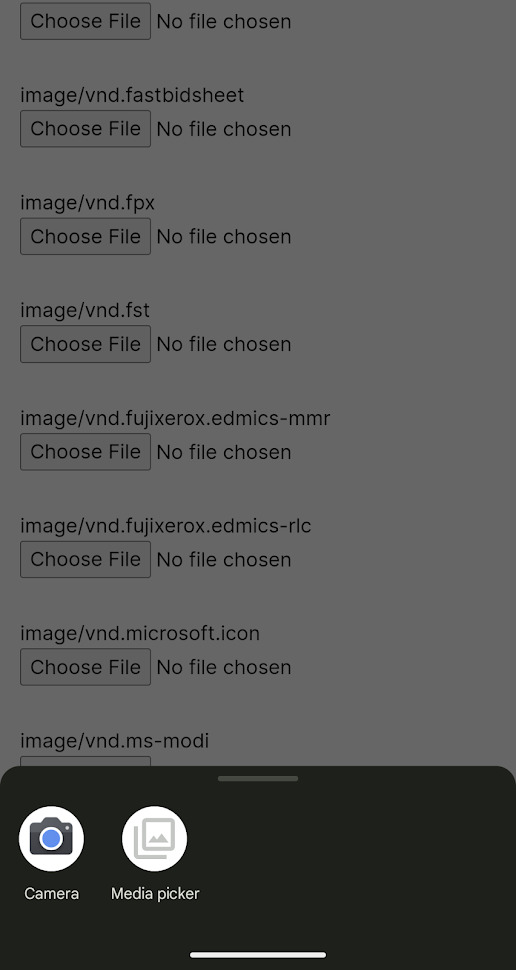
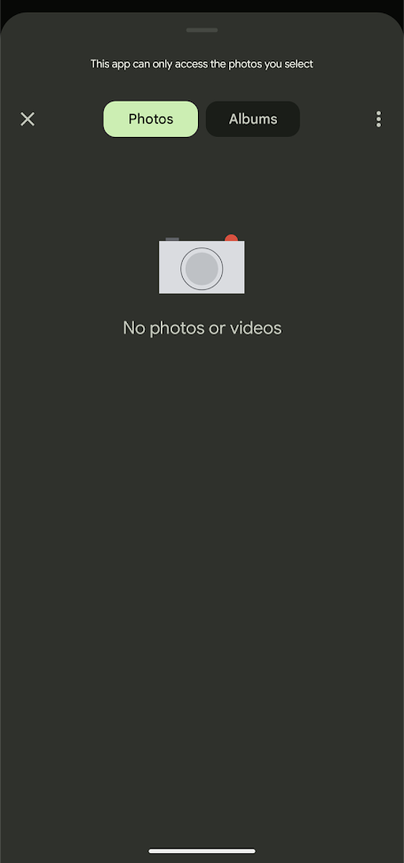

# Testing MIME Types

Seems like andriod selects to show a "media cloud selector" over a normal file selector when the MIME type is one that they know is an image. 

If you specify a lot of MIME types, some will be outside of android "image" MIME types, and the file selector will be shown instead of the media cloud selector.

| File Picker | Media cloud picker |
|-|-|
|  |  |

When creating a web app around uploading pictures, the preferred experience is to see your Google Photos instad of being asked to browse your files.